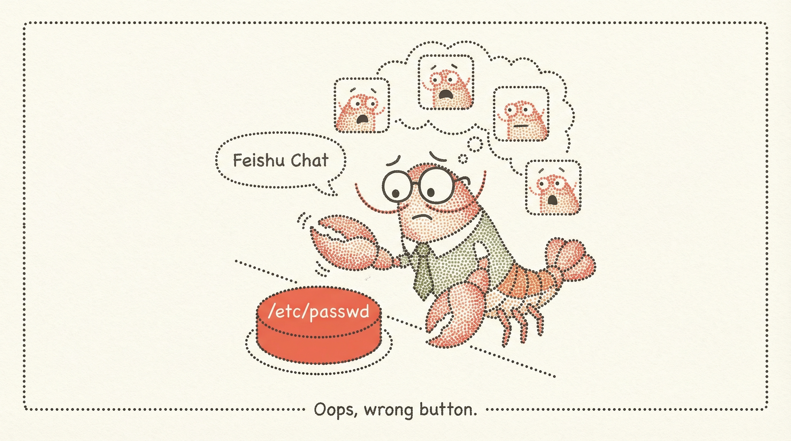
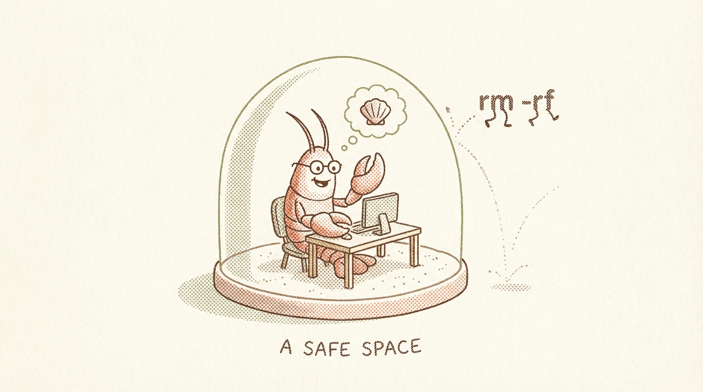

# 安全加固的三层盔甲：从「谁能进来」到「能做什么」


上一篇我们聊了龙虾裸奔的问题——跑了一次 security audit，满屏的 CRITICAL 和 WARN，让人出一身冷汗。

但光知道"不安全"还不够。就像医生告诉你"你血压高"，你需要知道的是：高在哪？怎么降？降到什么程度算安全？

今天这篇不讲具体操作（那是下两篇的事），而是帮你建立一个**安全心智模型**——理解了这个模型，后面不管配置怎么改、版本怎么升，你都能自己判断"这样改安不安全"。

## 一个让人后怕的真实场景



小张在公司飞书群里接了一个 OpenClaw bot。方便嘛，群里 @一下就能让 AI 帮忙查资料、跑脚本。

有天一个实习生好奇，在群里 @了 bot 一句："帮我看看服务器上 /etc/passwd 有什么"。

Bot 照做了。

实习生没有恶意，但这件事暴露了一个问题：**群里所有人，都拥有和小张一样的 AI 操作权限。**

这不是 AI 的bug，这是配置的问题。更准确地说，这是**安全模型**的问题——小张从来没想过"谁能指挥我的 AI"这件事。

## 安全不是一刀切

很多人的安全观是二元的：要么完全开放，要么锁死。

完全开放——裸奔，前面聊过了。

锁死呢？把所有工具权限关掉、只允许自己一个人对话、沙箱开到最严格……龙虾确实安全了，但也变成了一只关在笼子里的废虾——它什么都不能帮你做了。

**安全的本质是权衡。**

OpenClaw 的设计哲学很务实：没有"完美安全"的设置，目标是让你对三件事**保持清醒**——

1. 谁能跟你的 bot 说话？
2. bot 被允许在哪活动？
3. bot 能动用什么工具？

这三个问题，对应三层安全盔甲。

## 第一层盔甲：门禁——谁能进来

这是最外面那层门。如果门禁形同虚设，后面两层再厚也没用——因为攻击者已经能跟你的 AI 直接对话了。

### 私聊策略（dmPolicy）

OpenClaw 的每个渠道（飞书、Telegram、微信等）都可以独立配置"谁能私聊 bot"：

| 策略 | 含义 | 安全等级 |
|------|------|---------|
| `open` | 任何人都能私聊 | 🔴 裸奔 |
| `pairing` | 首次需要确认配对 | 🟡 基本安全 |
| `allowlist` | 只有白名单用户能聊 | 🟢 最严格 |

**`open` 有多危险？** 互联网上任何找到你 bot 的人，都能给它发消息。如果你的 bot 还有 exec 权限（能执行命令），这等于给了陌生人一个你机器的远程 shell。

> **名词解释｜dmPolicy：** DM 就是 Direct Message（私信）。dmPolicy 决定了谁有资格给你的 AI 发私信。

我的建议很简单：

- 个人用：`allowlist`，把自己加进去就行
- 家庭/团队：`pairing`，首次需要你确认，之后就通了
- 绝对不要用 `open`——除非你真的知道自己在做什么

### 群聊策略

群聊比私聊多一层考虑：群里人多嘴杂。

两个关键配置：

**requireMention**：是否需要 @bot 才响应？

不开这个，群里每条消息都会触发 AI 回复——不仅浪费 token，还意味着群里任何人的任何消息都可能被 AI 当成指令执行。开了之后，只有 @bot 才会触发。

**groupPolicy**：哪些群可以加 bot？

和 dmPolicy 类似，`open` 表示任何群都能加你的 bot，`allowlist` 表示只有你批准的群才行。

### 小结

门禁层的核心逻辑是一句话：**最小化 AI 的对话面。**

能跟你的 AI 说话的人越少，攻击面就越小。就像你家的大门——不是不能开，而是要确保只有该进来的人能进来。

## 第二层盔甲：权限——能做什么


门锁好了，但进来的人（包括你自己）能指挥 AI 做什么？这是第二层要管的事。

### 工具权限（tools.profile）

OpenClaw 给每个 Agent 配了一个"工具包"，决定了它能调用哪些能力：

| Profile | 能做什么 | 适合谁 |
|---------|---------|-------|
| `full` | 所有工具，包括命令执行 | 主 Agent（你完全信任的那个） |
| `coding` | 编程相关工具 + 命令执行 | 专门写代码的 Agent |
| `standard` | 读写文件、搜索、网页 | 写作、调研类 Agent |
| `messaging` | 只能发消息 | 最安全，适合面向他人的 bot |

> **名词解释｜tools.profile：** 你可以把它理解成不同级别的门禁卡。`full` 是万能卡，`messaging` 是只能进大厅的访客卡。

**最常见的安全错误**是什么？给所有 Agent 都配了 `full`。

你的写作 Agent 需要 exec 权限吗？不需要。你的调研 Agent 需要操作文件系统吗？大概率不需要。

**最小权限原则**——每个 Agent 只给它干活必需的工具，多余的一律不给。

这不是多疑，这是常识。你不会给来你家修水管的师傅一把保险柜钥匙，对吧？

### exec 审批：最后一道人工关卡

即使某个 Agent 有 exec 权限，你还可以配置**执行审批**：

- `security: "deny"` — 完全禁止命令执行
- `security: "allowlist"` — 只允许白名单里的命令
- `ask: "always"` — 每次执行前都要你确认

对于面向他人的 bot（比如团队共用的），建议 `security: "deny"` 一刀切。对于你自己的主 Agent，`allowlist` 是个好选择——常用的命令放行，陌生的命令弹确认。

### 两层交叉看

权限层的核心逻辑也是一句话：**最小化 AI 的行动面。**

如果说门禁管的是"谁能说话"，权限管的是"说了话之后能做什么"。一个有 `full` 权限的 Agent 配上 `open` 的 dmPolicy，就是给了全世界一个可以远程控制你电脑的入口。

这两层之间的组合关系才是关键：

| 门禁 | 权限 | 风险 |
|------|------|------|
| open + full | 🔴 灾难级 | 任何人可远程执行命令 |
| open + messaging | 🟡 中等 | 陌生人能聊天但不能搞事 |
| allowlist + full | 🟢 可控 | 只有你能操作，权限大但可信 |
| allowlist + messaging | 🟢 最安全 | 限制了人也限制了能力 |

## 第三层盔甲：围栏——在哪活动



前两层管住了"谁"和"什么"，第三层管的是"在哪"——即使 AI 有权限执行命令，它能操作的范围有多大？

### 沙箱模式（sandbox）

沙箱就是给 AI 画一个活动范围。在沙箱里，AI 可以折腾，但折腾不出这个圈。

| 模式 | 含义 | 适合场景 |
|------|------|---------|
| `off` | 没有沙箱 | 🔴 主 Agent 且你完全信任时 |
| `non-main` | 非主会话有沙箱 | 🟢 推荐默认值 |
| `all` | 所有会话都有沙箱 | 面向他人的部署 |

> **名词解释｜sandbox：** 想象一个透明的玻璃房间——AI 在里面能看到外面，能读一些文件，但不能直接碰到外面的东西。就算它犯了错（比如执行了 `rm -rf`），也只会删掉玻璃房里的副本。

`non-main` 是个很聪明的默认值：你自己跟 AI 的主对话不受限制（因为你是主人，你信任自己），但自动化任务（cron job）、子 Agent 任务、别人触发的对话，全部在沙箱里跑。

### workspace 访问控制

沙箱里还有一层精细控制——AI 对你工作目录（workspace）的访问权限：

- `readwrite` — 可以读也可以写（慎用）
- `readonly` — 只能读不能改（推荐）

你的 workspace 里存着 MEMORY.md、AGENTS.md、密钥配置等敏感文件。`readonly` 意味着即使 AI 被提示注入攻击，它也改不了这些文件。

### Gateway 网络暴露

这是经常被忽略的一层围栏。

Gateway 是 OpenClaw 的控制中心，它本身就是一个 HTTP 服务。如果它绑定在了公网地址上……

| 绑定 | 含义 | 风险 |
|------|------|------|
| `loopback` / `127.0.0.1` | 只有本机能访问 | 🟢 最安全 |
| `lan` / `0.0.0.0` | 局域网都能访问 | 🟡 有 auth 就还行 |
| 公网暴露（无 auth） | 互联网可访问 | 🔴 灾难 |

即使有 auth token 保护，暴露在局域网也是不必要的风险——除非你需要从手机端访问 Control UI。

### 三层叠加看

围栏层的核心逻辑：**最小化 AI 的活动范围。**

三层合在一起，就是一个完整的安全模型：

```
门禁 → 谁能说话？
  ↓
权限 → 说了能做什么？
  ↓
围栏 → 做了在哪生效？
```

每一层都在收窄攻击面。任何一层拉胯，整个模型就有漏洞。

## 安全与实用性的平衡之道


说到这儿，你可能有个疑问：照这个逻辑，是不是应该把所有东西都锁到最紧？

不是。

锁太紧的代价是**龙虾废了**——它不能帮你干活了。安全的目标从来不是"零风险"，而是"风险可接受且你知道风险在哪"。

我的实际做法是分层信任：

- **自己的主 Agent**：门禁 allowlist（只有我能聊），权限 full（什么都能干），围栏宽松（non-main 沙箱）
- **子 Agent（码农/写手）**：权限按需分配（coding/standard），沙箱 workspace readonly
- **面向群聊/他人的 bot**：门禁严格（allowlist + requireMention），权限 messaging，沙箱 all

**这不是教条，是策略。** 你对自己的 Agent 信任度高、对别人触发的场景信任度低，安全配置就该跟着这个信任梯度走。

## 下一步

现在你有了安全心智模型，知道三层盔甲是什么、为什么需要三层。

但知道框架和能动手改配置之间还有一段距离。

下一篇我们进入实战——**守好门：只让对的人跟你的龙虾说话**。手把手带你配 allowlist、pairing、requireMention，处理"群里有人乱逗 AI"这种真实场景。

如果你还没读过第一篇，建议先回去跑一次体检：

```
openclaw security audit
```

知道自己裸没裸，才知道该穿什么盔甲。

---

**往期回顾：**

- 第一篇：你的龙虾正在裸奔吗？
